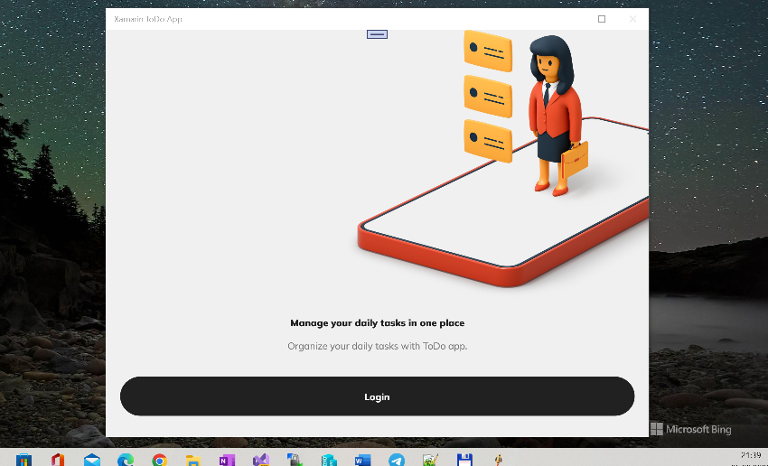

# Xamarin ToDo App

This is my fork. The main goal was to add UWP target to Xamarin-ToDo-App solution.

## About the original 

**Todo App** is a simple to do app developed with **Xamarin** and **Firebase**. The app allows you to create an account and login to create tasks and organize them into lists. You can see the tasks for the selected date in realtime mode, edit and delete them with swipe action, reorder them using drag and drop action and filter them by list from More screen. From Profile screen you can hide completed tasks on the main screen and see the total number of tasks, of completed tasks and lists that you created for your account. The app is available in both **light** and **dark mode**.

## Screenshots

## Used Libraries / Dev Resources

- [Xamarin Forms 5.0](https://github.com/xamarin/Xamarin.Forms)
- [Xamarin Essentials](https://github.com/xamarin/Essentials) (Internet Connection, Preferences)
- [Xamarin CommunityToolkit](https://github.com/xamarin/XamarinCommunityToolkit)
- [Xamarin Firebase Auth](https://github.com/xamarin/GooglePlayServicesComponents) (Firebase Authentication)
- [Prism.Forms](https://github.com/PrismLibrary/Prism) (MVVM, Dialogs)
- [Fody](https://github.com/Fody/Fody)
- [Reactive UI](https://github.com/reactiveui/ReactiveUI) (Realtime)
- [Firebase Firestore](https://github.com/f-miyu/Plugin.CloudFirestore) (CRUD Operations)

## Firebase Preparing / Setup

The app is using **Firebase**. To start the project you need to create a Firebase project.

#### Android

- In the **Firebase Console** go to **Project settings**
- Add **Android App** and add **com.gheorghedarle.todoapp** as **Android package name** and click on **Register app**
- Download **google-services.json** and add it to root of the **Android project** in the solution. Select **GoogleServicesJson** as **Build Action** in the **Properties** of the file

#### iOS

- In the **Firebase Console** go to **Project settings**
- Add **iOS App** and add **com.gheorghedarle.todoapp** as **Apple bundle ID** and click on **Register app**
- Download **GoogleService-Info.plist** and add it to root of the **iOS project** in the solution. Select **BundleResource** as **Build Action** in the **Properties** of the file

### UWP

- ???

After you finish with the configuration enable **Email/Password** as a provider for sign-in in the Firebase console.

- In the **Firebase Console** go to **Authentication** under **Build** option in the menu.
- In the **Sign-in method** tab enable **Email/Password**

## ..

AS IS. No support. Experimental software! RnD only.

## .

[m][e] 2022
